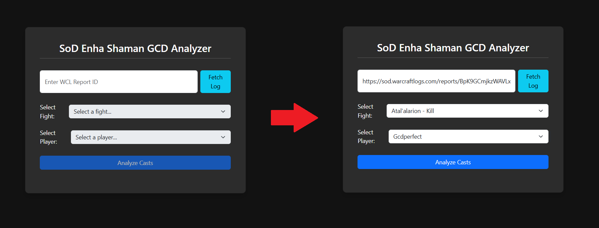
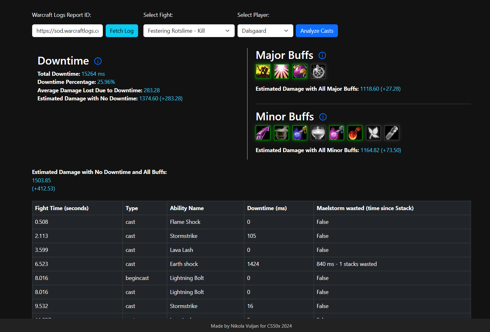
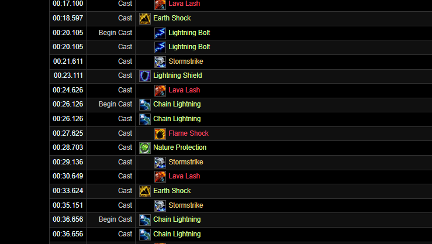

# WoW SoD P3 - enhancement shaman analyzer
#### Description: 
A novice learning project made for CS50x, using Python, Flask, Warcraftlogs API, HTML, JS - bootstrap

## Overview
 A tool made during phase 3 on World of Warcraft - Season of Discovery to analyze warcraftlogs for enhancement shamans' downtime between spells and wastage of maelstorm stacks as well as estimating damage lost or gained by using specific world buffs. Buffs and rotation spell list would have to be manually updated per tier.

---

Landing page

Analysis page

---

### Usage Example

1. Input a Warcraft Logs report link or ID.
2. Select a fight and player.
3. Toggle buffs on/off.
4. View downtime, buffs, and DPS metrics.
5. Use the event table to review casts and wasted Maelstrom opportunities.

### Issue it aims to solve:
Warcraftlogs makes it hard to analyze true gcd downtime, such as requiring the user to manually do math and check if each spell used was an instant spell, off-gcd spell or neither.

---

### How it works

1. **Fetching a log**:
   - Allows users to input a Warcraft Logs report ID or link.
   - Fetches fights, players, and event data using the Warcraft Logs API.
   - Provides a list of available fights and players to select for analysis.

2. **Event Analysis**:
   - Processes cast events to calculate downtime between abilities.
     - Spells that are on a global cooldown in WoW Vanilla have a 1.5 second hard cap regardless of players haste - making it easier to calculate downtime compared to modern wow
   - Cast events processed are spells in the list "spell_names" - this is due to possible casts that are not part of the rotation or off-gcd spells such as potions.
   - Highlights wasted maelstorm stacks - after gaining 5 stacks it is important not to sit on them for long as you waste damage output of further incoming stacks
   - Displays a table of cast events, including:
     - Fight time.
     - Event type.
     - Ability name.
     - Downtime between casts.
     - Maelstrom wasted.

3. **Buff Tracking**:
   - Automatically assigns **Major Buffs** from the log.
   - Allows user to manually input missing **Minor Buffs** to estimate dps lost. (unable to query them due to log limitations)
   - Displays buffs as icons, each toggleable to estimate their effect on DPS.
   - Dynamically estimates the impact of missing buffs or downtime on overall DPS. (numbers are assumed from full bis sim, taken as a percentile dmg loss)

## Functions

#### Using the Warcraftlogs API

   - source: https://www.warcraftlogs.com/api/docs
   - schema: https://www.warcraftlogs.com/v2-api-docs/warcraft/

#### Handling the tokens
##### **`get_token`,`store_token`,`retrieve_headers`**:
   - Fetches the OAuth token required for API access from Warcraft Logs.
   - Stores the token in a local json file for subsequent API calls.
   - source: https://www.youtube.com/watch?v=YobeR-Uaqiw

##### **`fetch_report_details`**:
   - Fetches metadata about the report, including fights and players.
   - Returns a list of fights and players for the user to choose from.

##### **`get_cast_events`**:
   - Fetches all cast events for the selected player and fight.
   - Returns raw event data for processing.

##### **`get_buff_events`**:
   - Fetches raw buff event data for the player during the fight.
   - Hardcoded to filter for maelstorm weapon buff, but can be adapted for more if they were needed for processing

##### **`get_buff_table`**:
   - Used for purposes of easily accessing active World buffs and their uptime without many queries, compared to the raw event tabled above as the exact order and timestamps aren't necessary
   - Filtered by `relevant buffs` list via `get_worldbuff_presence` function that would be changed per phase of content

##### **`process_events`**:
   - Strips events from `get_cast_events` to match those in `spell_names` list
   - `spell_names` contains abilities necessary for enhancement shamans output as per simulation action priority list - casting non-offensive spells will be seen as downtime
   - Uses a moving `last_when_free` variable to estimate when player is free to act, in case of instant casts in 1.5 seconds and in case of normal casts, at the mathematical maximum of 1.5 seconds and the casts duration
   - Appends next to every start cast the time of that cast subtracted by the `last_when_free` variable
   - Uses `find_most_recent_relevant_buff` function to append time since you've hit 5 maelstorm stacks to events indicating potentially un-optimal casts

##### **`get_player_dps`**:
   - Used for retrieving players dps to be used for estimating damage gained and lost in the javascript in events.html

### Frontend

##### **Layout**
   - Written in HTML, CSS, JS with bootstrap library using chatgpt for different contains to fit nicely
   - layout.html contains CSS styling, title and footer
   - index.html contains a simple input interface similar to other analyzers
     - Allows flexible link/id input due to `extract_report_code` function stripping the links
   - events.html contains multiple bootstrap flex containers and javascript for handling dps estimation

##### **Buff Toggles**:
   - Allows users to interactively enable/disable buffs via clickable icons.
   - Contains major buffs relevant to the current content phase and minor buffs relevant to the class
  

##### **Dynamic DPS Estimation**:
   - Estimates potential DPS based on active buffs and downtime in real-time.
   - Is very primitive, using simulation from WoWSims to estimate percentage gained and lost per buff in best in slot gear

### Potential improvements

- **Recode in ajax**
  - The main reason for me not to work on it deeper as it would eliminate hosting and let it be a standalone page on github instead of running it as an http-server webapp

- **Multi-class support**:
  - Add "spell_name" library for all current classes depending on current rotation for the phase

- **Multi-phase support**:
  - Recognize phase of content by zone ID or world buffs present on players
  - Dynamically change Major Buffs from that info

- **Exportable reports**:
  - Allow users to copy summaries to clipboard for sharing on socials such as discord.

- **Advanced action priority list comparison**:
  - Integrate with external action priority lists for deeper analysis of performance potential.
  - For example - using the current buff state at start of every GCD check the APL for a recommendation and compare with the report